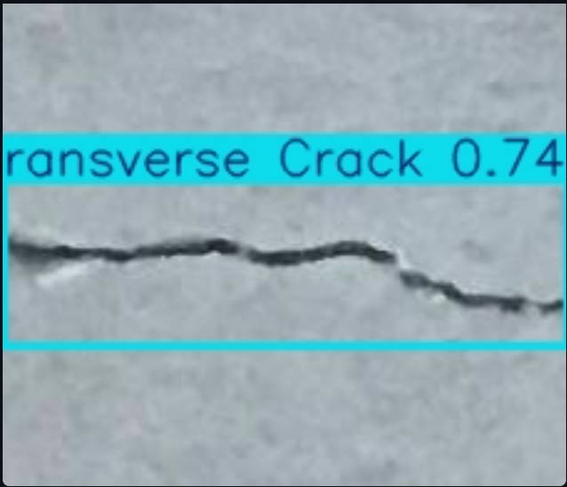
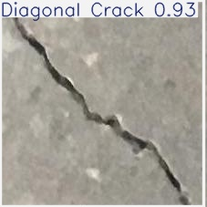
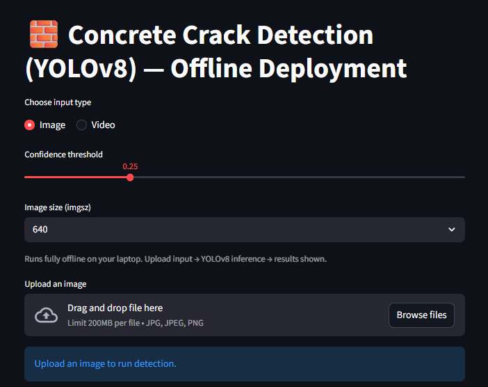
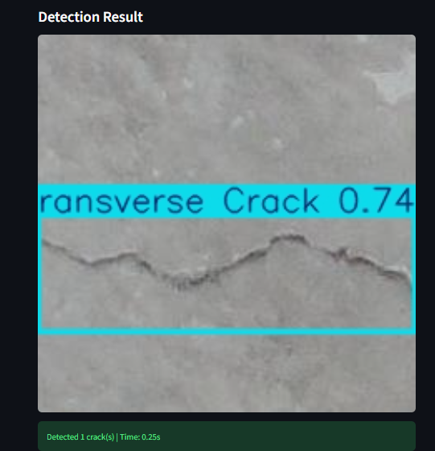
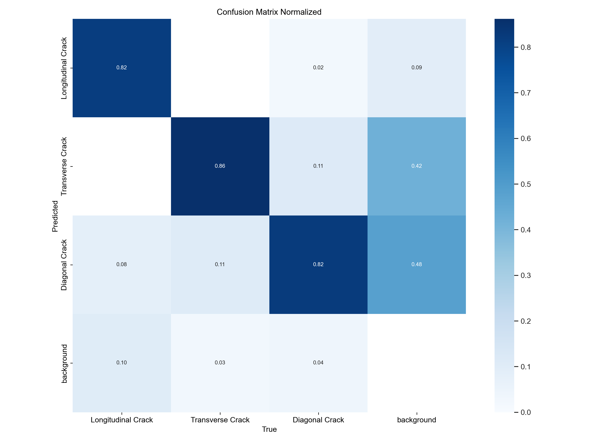
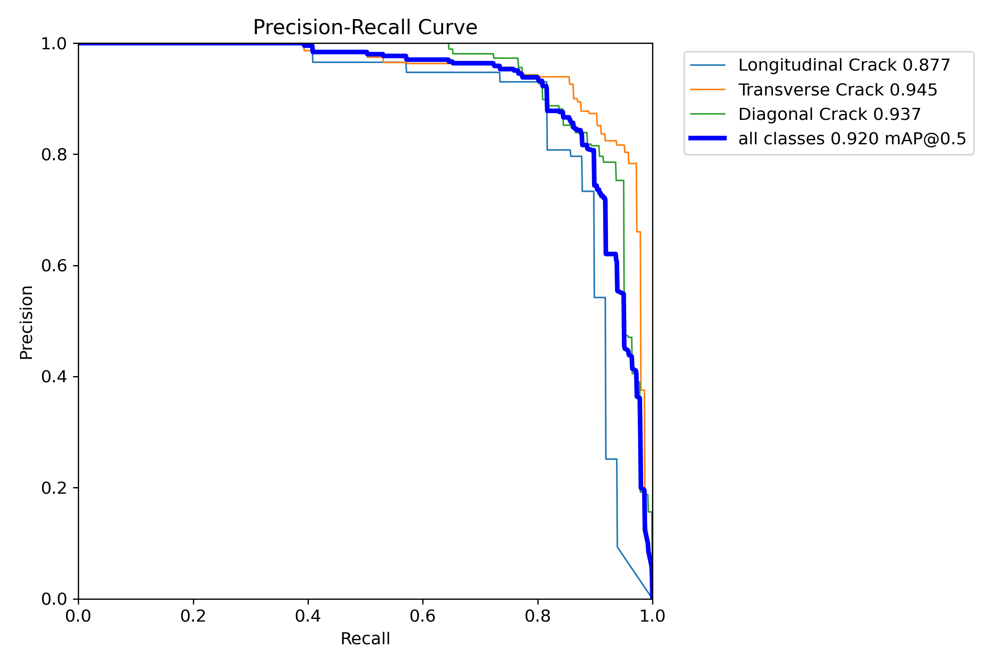
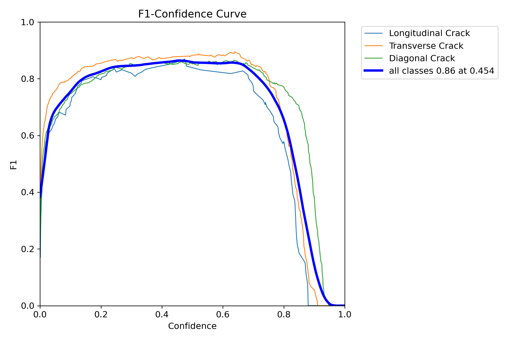
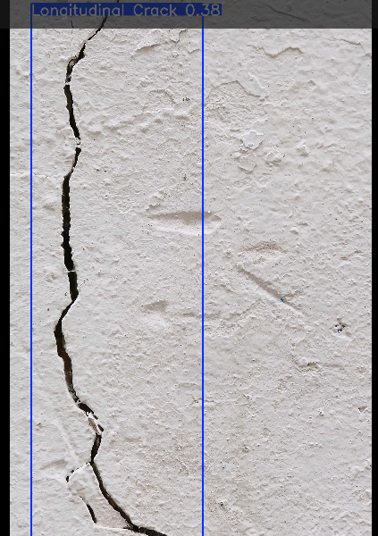

# Automated Concrete Crack Detection and Classification using YOLO

## Project Overview

This project is an AI-powered concrete crack detection and classification system developed using YOLO and Streamlit. The main goal of this work is to automatically identify cracks in concrete structures and classify them into different crack categories using deep learning techniques.

The project was originally developed as part of my M.S. thesis work in Construction Engineering and Management, where I explored the use of computer vision and deep learning for structural inspection and damage assessment.

Traditional crack inspection methods are often time-consuming, manual, and dependent on human judgment. This system aims to support faster and more consistent inspection by using an AI model capable of detecting and classifying cracks directly from images and videos.

The application provides a simple Streamlit interface where users can upload:
- Images of concrete cracks
- Videos containing cracks

The model then performs crack detection and classification automatically.

---

# Crack Categories

The model is trained to classify concrete cracks into the following categories:

- Longitudinal Cracks
- Transverse Cracks
- Diagonal Cracks

---

# Features

This project includes the following features:

- Concrete crack detection using YOLO
- Crack classification into multiple categories
- Image-based crack analysis
- Video-based crack analysis
- Streamlit-based user interface
- Visualization of prediction results
- Bounding box detection
- Confidence score prediction
- Deep learning-based inference pipeline

---

# Technologies Used

The following technologies and libraries were used in this project:

- Python
- YOLO
- PyTorch
- OpenCV
- Streamlit
- NumPy
- Pillow

---

# Why This Project Was Developed

Concrete structures naturally develop cracks over time due to environmental conditions, loading, aging, and construction-related issues. Manual inspection of these cracks can be difficult, especially when dealing with large structures or repetitive inspection tasks.

The purpose of this project was to explore how artificial intelligence and computer vision can assist civil engineers in automating the crack inspection process.

This project combines my background in:
- Civil Engineering
- Construction Engineering
- Artificial Intelligence
- Computer Vision

---

# Project Workflow

The overall workflow of the system is:

1. Upload image or video
2. Preprocess input data
3. Run YOLO inference
4. Detect crack regions
5. Classify crack type
6. Display prediction results
7. Save output visualization

---

# Project Structure

```bash
Concrete-Crack-Detection/

│── app.py
│── requirements.txt
│── README.md
│── best.pt

├── images/
├── results/
├── screenshots/
├── sample_videos/
```

---

# Model Evaluation

The model was evaluated using standard deep learning evaluation metrics.

Evaluation results included:
- Confusion Matrix
- Precision Curve
- Recall Curve
- Precision-Recall Curve
- F1 Score Curve

These evaluation graphs are included inside the repository.

---

# Streamlit Interface

The project uses Streamlit to provide a simple and interactive user interface.

Users can:
- Upload images
- Upload videos
- Run crack detection
- Visualize results directly in the browser

This makes the project easier to test and demonstrate without requiring advanced technical setup.

---

# Sample Results

## Crack Detection Example




## Streamlit Application Interface



## Model Evaluation Graphs

### Confusion Matrix


### Precision-Recall Curve


### F1 Score Curve


## Video Crack Detection Example



---
# Video Demonstration

A sample crack detection video is included inside the `sample_videos` folder.

The demo video shows the model performing crack detection and classification on concrete surface footage using the trained YOLO model and Streamlit interface.

Sample video file:

```bash
sample_videos/crack_video.mp4
```

# Installation

## Clone Repository

```bash
git clone YOUR_GITHUB_LINK_HERE
```

---

## Install Required Libraries

```bash
pip install -r requirements.txt
```

---

## Run Streamlit Application

```bash
streamlit run app.py
```

---

# Future Improvements

Some possible future improvements for this project include:

- Real-time webcam crack detection
- Deployment on cloud platforms
- Mobile-friendly interface
- Additional crack categories
- Multi-defect detection
- Improved model optimization
- Integration with drone inspection systems

---

# Learning Experience

This project was an important learning experience for me in the fields of:
- Deep Learning
- Computer Vision
- Object Detection
- AI Deployment
- Research and Model Evaluation

It also helped me better understand how AI can be applied to real-world engineering problems.

---

# Author

Md Usman Ahmad

Background:
- Civil Engineering
- Construction Engineering and Management

Interests:
- Computer Vision
- Deep Learning
- AI for Civil Engineering
- Robotics and Automation

